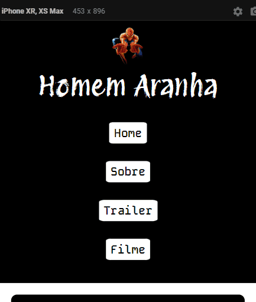

# Projeto Pessoal - Homem Aranha

## Descrição do Projeto

Esse é um projeto pessoal que realizei mediante a determinados fatores, a princípio eu só iria fazer um menu responsivo para me testar, após encerrar o menu acabei achando muito simples para subir para o github, e acabei continuando esse projeto usando o tema do menu que era o Homem Aranha, optei por finalizá-lo com a ordem cronológica dos filmes do Homem Aranha, e ficou até que interessante, mas a finalidade de tudo foi concluída que era fazer um projeto responsivo e testar as minhas habilidades com display flex.

### Layout Deskitop 

### Layout Mobile

### Tecnologias utilizadas

